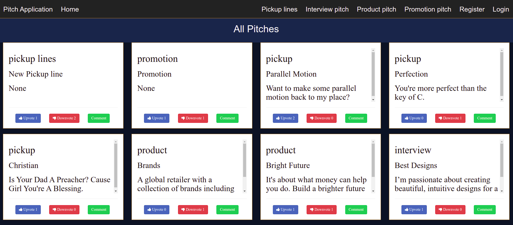

# Flask Pitch

## By David Rono

## Description

Flask Pitch application allows users to submit their one minute pitches and other users can upvote or download on them and also have a chance to comment on their pitch.

## Setup Requirements

* Flask
* Pip
* Git
* Python 3.8

## Setup Installation

* use git clone  https://github.com/kibetrono/Flask---One-Minute-Pitch 

* on the terminal, use the following commands

 
``` virtualenv virtual ``` to create new environment

```source virtual/bin/activate``` to activate the virtual environment

```chmod a+x start.sh ``` to make start.sh file executable

```./start.sh ``` to run the application and the open the provided link on your preffered browser.


## Technologies Used

* HTML
* CSS
* Bootstrap
* Python
* Flask
* Heroku

## Live Link

* [Click Here]( https://pitchflaskapplication.herokuapp.com/) to view Flask Pitch Application

## Some Screenshots




## Contact Information

* Email: kibetdavidro@gmail.com
* Phone: +254728234794


## MIT licence

<p>Copyright (c) 2022 David Rono </p>

Permission is hereby granted, free of charge, to any person obtaining
a copy of this software and associated documentation files (the
"Software"), to deal in the Software without restriction, including
without limitation the rights to use, copy, modify, merge, publish,
distribute, sublicense, and/or sell copies of the Software, and to
permit persons to whom the Software is furnished to do so, subject to
the following conditions:

The above copyright notice and this permission notice shall be
included in all copies or substantial portions of the Software.

THE SOFTWARE IS PROVIDED "AS IS", WITHOUT WARRANTY OF ANY KIND,
EXPRESS OR IMPLIED, INCLUDING BUT NOT LIMITED TO THE WARRANTIES OF
MERCHANTABILITY, FITNESS FOR A PARTICULAR PURPOSE AND
NONINFRINGEMENT. IN NO EVENT SHALL THE AUTHORS OR COPYRIGHT HOLDERS BE
LIABLE FOR ANY CLAIM, DAMAGES OR OTHER LIABILITY, WHETHER IN AN ACTION
OF CONTRACT, TORT OR OTHERWISE, ARISING FROM, OUT OF OR IN CONNECTION
WITH THE SOFTWARE OR THE USE OR OTHER DEALINGS IN THE SOFTWARE.

